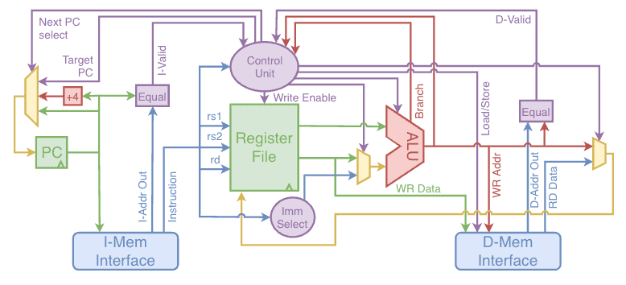

RISC V の例 (from BRISC-V: An Open-Source Architecture Design Space Exploration Toolbox)

:::tip[単純な流れ]
- プログラムカウンタ (PC) から命令メモリにアクセスして, 命令を取得
- 命令をデコード
- レジスタファイルにアクセスして, データを読み書き
- 必要ならメモリにアクセスして, データを読み書き
- ALU で演算して, 結果をレジスタファイルや, 必要ならメモリに書き込む
- プログラムカウンタを更新して, 次の命令を取得
:::

以降はもう少し詳しく説明.

## 主記憶装置
メインメモリ, 単にメモリ, とも. レジスタより大容量化が容易な回路. 一般には DRAM が使われる.
- ロード操作
    1. リクエスト: ほしいバイト数などフォーマット指定情報, **メモリアドレス**を主記憶装置に渡す
    2. メモリから読み出された値を（書き込み値選択して）レジスタへ書き込む
- ストア操作
    1. リクエスト: フォーマット指定情報, （ALUによりリクエストに生成された）**書き込み値**, **メモリアドレス**を主記憶装置に渡す
    2. ALUによりリクエストに必要なデータを生成, メモリへ書き込み

### メモリアレイの基本構造
- ビットセルの二次元配列で, 各ビット・セルは1ビットを保持
- アドレス幅が $N$ , データ幅 $M$の場合, $2^N$ 行 $M$ 列
- エントリ数：行数（ワード数）$2^N$
- ワード・サイズ：列数 $M$
- アレイ・サイズ： $2^N\times M$

### メモリの分類
ちょっと脱線. メモリってどんなのがあるか.
:::note[メモリの分類]
- ROM（Read Only Memory）：一般的なコンピュータのメインメモリなど
    - マスクROM：作る段階ですでに何記憶するか決まっている
    - PROM（ユーザーの手で一度だけ書き込める）
        - ヒューズROM：簡単に焼き切れる
        - EPROM（Erasable PROM）：特別な行為（紫外線等）で書き換えられるもの
            - UVEPROM
            - EEPROM
            - フラッシュメモリ：よく使われる
- RAM（Random Access Memory）：例えば, カセットは初めが決まっているので違う. 揮発（電源を切ると内容が消える）. 
    - SRAM（インバータ二つのバイ・ステーブル回路）: レジスタとして使われることが多い（**少し高いが早い**）
        - ダブルエンド: 同相ノイズをキャンセル
            - 読み出し時：
                - まず両方のBLを’1’にチャージ
                - WLをアサート(‘1’にする)
                - BL同士の差動センス・アンプを作動させて値を高速に確定
            - 書き込み時：
                - BLに値をセットしてからWLをアサート
        - 6 トランジスタくらい
    - DRAM（コンデンサ）: 主記憶として使われることが多い（**安いが, 少し遅め**）
        - 高速ページモードDRAM
        - SDRAM（Synchronous DRAM）
        - 「動的(dynamic)」：キャパシタの自然放電により電荷(情報)が失われるので
        リフレッシュ(再書き込み)が必要
            - 定期的に読んで書き戻し
            - 通常の読み出しでも値が壊れるので書き戻しが必要
        - 1 トランジスタくらいで大丈夫
        - レイテンシは悪いが, スループットはよくなる工夫がされている
:::
## 命令とシーケンサ
:::tip[命令とシーケンサ]
**命令：コンピュータの動作を指定する情報**  
**シーケンサ：順次命令を生成する機構**
:::
命令を集めてアルゴリズムやプログラムを実現する. 命令の詳細は次回.
- 命令はデータとして（例えば32bit列として）表現される
- 数個のフィールドからなり, メモリに入れられ, 読みだして使われる（= フェッチ）
- “Instruction Set Architecture”（ISA）: そのコンピュータが受け付ける命令集合の仕様

一方で, シーケンサは次の順次命令を生成する機構.   
PC(プログラムカウンタ)が現在実行中の命令アドレスを保持するレジスタ. 
NPC（= PC + 4（大抵））を命令メモリに渡すことで, 次の命令を取得する.

## 基本的なコンピュータの構成
:::tip[基本的なコンピュータの構成]
- プロセッサ: コンピュータの中心部. メモリの指示内容に従ってメモリを書き換えるユニット（Central Processing Unit）
    - CPU, GPU, DSP, TPU, NPU, etc.
    - 主記憶装置から取り出した命令を一つ読み, データ操作して, 次の命令アドレスを決定することを繰り返す. （= プログラム内蔵方式）
- 主記憶装置: プロセッサがアクセスするメモリ
    - メインメモリ, キャッシュメモリ, etc.
- 補助記憶装置: メインメモリより大容量の記憶装置
    - ハードディスク, SSD, テープ, etc.
- 入出力装置: プロセッサと外部機器を接続する装置
    -  キーボード, マウス, ディスプレイ, ストレージ装置, etc. 
    - プログラムデータや結果を記憶装置を通じてやり取りする
:::

https://www.nt-go.com/posts/post11.html より引用. ノイマン型コンピューターと呼ばれる.

その他
- マイクロプロセッサ：1つのICに収まっているプロセッサ.
今では, 一般的にはプロセッサの（複数）入ったチップ/パッケージ